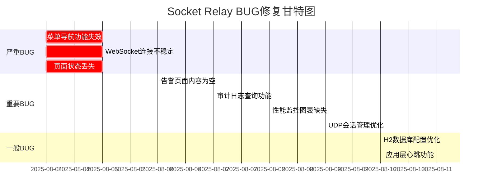

# 📅 Socket Relay BUG修复日程表

## 🗓️ 修复时间线

---

## 📋 每日修复计划

### 2025-08-04 (周日) - 项目分析日
**状态**: ✅ 已完成
- [x] **09:00-12:00**: 全面代码分析和BUG识别
- [x] **13:00-15:00**: 创建BUG跟踪文档和修复计划
- [x] **15:00-16:00**: 修复BUG-008 Toast提示位置问题
- [x] **16:00-18:00**: 开始分析严重BUG的根本原因

**完成情况**: 
- ✅ 识别10个BUG并分类
- ✅ 建立完整的BUG跟踪体系
- ✅ 修复1个一般BUG

---

### 2025-08-05 (周一) - 严重BUG修复日
**状态**: 🔄 进行中
**目标**: 修复所有严重BUG，恢复系统基本功能

#### 上午 (09:00-12:00)
- [ ] **09:00-10:30**: 修复BUG-001 菜单导航功能失效
  - 重写showPage函数逻辑
  - 修复事件绑定冲突
  - 测试页面跳转功能
- [ ] **10:30-12:00**: 修复BUG-002 WebSocket连接不稳定
  - 修复库检测逻辑
  - 优化连接重试机制
  - 测试实时推送功能

#### 下午 (13:00-18:00)
- [ ] **13:00-15:00**: 修复BUG-003 页面刷新后状态丢失
  - 修复URL路由解析
  - 优化页面初始化流程
  - 测试浏览器历史记录支持
- [ ] **15:00-17:00**: 集成测试和回归测试
  - 验证所有严重BUG修复效果
  - 确保系统基本功能正常
- [ ] **17:00-18:00**: 代码审查和文档更新

**预期成果**: 
- ✅ 菜单导航正常工作
- ✅ WebSocket连接稳定
- ✅ 页面状态正确保持

---

### 2025-08-06 (周二) - 告警功能完善日
**状态**: 📋 计划中
**目标**: 完善告警页面功能，提升用户体验

#### 全天任务 (09:00-18:00)
- [ ] **09:00-11:00**: 设计告警列表UI组件
  - 创建告警卡片组件
  - 实现告警级别颜色区分
  - 添加告警时间格式化
- [ ] **11:00-13:00**: 实现告警数据获取和显示
  - 调用后端告警API
  - 实现告警列表渲染
  - 添加空状态处理
- [ ] **14:00-16:00**: 添加告警过滤和搜索功能
  - 按级别过滤告警
  - 按时间范围筛选
  - 关键词搜索功能
- [ ] **16:00-18:00**: 集成实时告警推送
  - WebSocket告警推送显示
  - 新告警提醒功能
  - 测试告警功能完整性

**预期成果**: 
- ✅ 告警页面功能完整
- ✅ 实时告警推送正常
- ✅ 用户体验良好

---

### 2025-08-07 (周三) - 审计日志功能日
**状态**: 📋 计划中
**目标**: 实现完整的审计日志查询功能

#### 全天任务 (09:00-18:00)
- [ ] **09:00-11:00**: 实现loadLogsData()函数
  - 调用审计日志API
  - 处理日志数据格式
  - 实现错误处理逻辑
- [ ] **11:00-13:00**: 设计日志查询界面
  - 创建日志表格组件
  - 实现日志详情展示
  - 添加操作类型图标
- [ ] **14:00-16:00**: 添加日志过滤条件
  - 按操作类型过滤
  - 按用户过滤
  - 按时间范围过滤
- [ ] **16:00-18:00**: 实现日志分页显示
  - 前端分页组件
  - 后端分页API调用
  - 性能优化

**预期成果**: 
- ✅ 审计日志查询功能完整
- ✅ 日志过滤和搜索正常
- ✅ 分页显示性能良好

---

### 2025-08-08 (周四) - 监控图表实现日
**状态**: 📋 计划中
**目标**: 实现完整的性能监控图表功能

#### 全天任务 (09:00-18:00)
- [ ] **09:00-11:00**: 集成Chart.js图表库
  - 引入Chart.js依赖
  - 配置图表基础样式
  - 创建图表容器组件
- [ ] **11:00-13:00**: 实现实时数据图表
  - 连接数实时图表
  - 流量统计图表
  - 错误率趋势图表
- [ ] **14:00-16:00**: 添加历史数据查看
  - 时间范围选择器
  - 历史数据API调用
  - 图表数据更新逻辑
- [ ] **16:00-18:00**: 优化图表性能和响应式设计
  - 图表渲染性能优化
  - 移动端适配
  - 数据缓存机制

**预期成果**: 
- ✅ 监控图表功能完整
- ✅ 实时数据更新正常
- ✅ 响应式设计良好

---

### 2025-08-09 (周五) - 系统稳定性优化日
**状态**: 📋 计划中
**目标**: 修复UDP会话管理问题，提升系统稳定性

#### 全天任务 (09:00-18:00)
- [ ] **09:00-11:00**: 分析UDP会话生命周期
  - 审查现有会话管理代码
  - 识别内存泄漏风险点
  - 设计会话清理策略
- [ ] **11:00-13:00**: 实现会话超时清理机制
  - 添加会话超时检测
  - 实现自动清理逻辑
  - 配置清理参数
- [ ] **14:00-16:00**: 添加内存使用监控
  - 会话数量统计
  - 内存使用量监控
  - 告警阈值设置
- [ ] **16:00-18:00**: 编写单元测试验证修复
  - UDP会话测试用例
  - 内存泄漏测试
  - 压力测试验证

**预期成果**: 
- ✅ UDP会话管理优化
- ✅ 内存泄漏风险消除
- ✅ 系统稳定性提升

---

### 2025-08-10 (周六) - 配置优化日
**状态**: 📋 计划中
**目标**: 优化H2数据库配置，提升性能

#### 半天任务 (09:00-13:00)
- [ ] **09:00-10:00**: 评估LEGACY模式必要性
  - 分析当前配置影响
  - 测试标准模式兼容性
- [ ] **10:00-11:00**: 优化数据库连接配置
  - 调整连接池参数
  - 优化SQL执行性能
- [ ] **11:00-12:00**: 测试配置变更效果
  - 性能基准测试
  - 功能回归测试
- [ ] **12:00-13:00**: 更新配置文档
  - 配置说明文档
  - 性能调优指南

**预期成果**: 
- ✅ 数据库配置优化
- ✅ 系统性能提升
- ✅ 配置文档完善

---

### 2025-08-11 (周日) - 心跳功能完善日
**状态**: 📋 计划中
**目标**: 实现完整的应用层心跳保活功能

#### 全天任务 (09:00-18:00)
- [ ] **09:00-11:00**: 实现心跳包发送逻辑
  - 设计心跳包格式
  - 实现定时发送机制
  - 配置心跳间隔参数
- [ ] **11:00-13:00**: 添加心跳响应检测
  - 心跳响应处理逻辑
  - 超时检测机制
  - 连接状态管理
- [ ] **14:00-16:00**: 配置心跳参数
  - 心跳间隔配置
  - 超时阈值设置
  - 重试次数配置
- [ ] **16:00-18:00**: 测试心跳保活效果
  - 网络中断测试
  - 长连接稳定性测试
  - 性能影响评估

**预期成果**: 
- ✅ 应用层心跳功能完整
- ✅ 连接保活效果良好
- ✅ 系统稳定性提升

---

## 📊 里程碑计划

### 🎯 第一阶段: 核心功能修复 (2025-08-04 ~ 2025-08-05)
**目标**: 修复所有严重BUG，恢复系统基本可用性
- ✅ BUG识别和分析
- 🔄 菜单导航修复
- 🔄 WebSocket连接修复
- 🔄 页面状态保持修复

### 🎯 第二阶段: 功能完善 (2025-08-06 ~ 2025-08-08)
**目标**: 完善重要功能，提升用户体验
- 📋 告警页面功能
- 📋 审计日志查询
- 📋 监控图表实现

### 🎯 第三阶段: 系统优化 (2025-08-09 ~ 2025-08-11)
**目标**: 优化系统性能和稳定性
- 📋 UDP会话管理优化
- 📋 数据库配置优化
- 📋 心跳功能完善

---

## ⚠️ 风险评估

### 高风险项目
1. **WebSocket连接修复** - 涉及多个库的兼容性问题
2. **菜单导航修复** - 前端框架深度集成问题
3. **UDP会话管理** - 可能影响现有连接稳定性

### 风险缓解措施
- 充分的单元测试和集成测试
- 分阶段发布，逐步验证修复效果
- 保留回滚方案，确保系统可用性

---

*最后更新: 2025-08-04*
*项目经理: Socket Relay团队*
